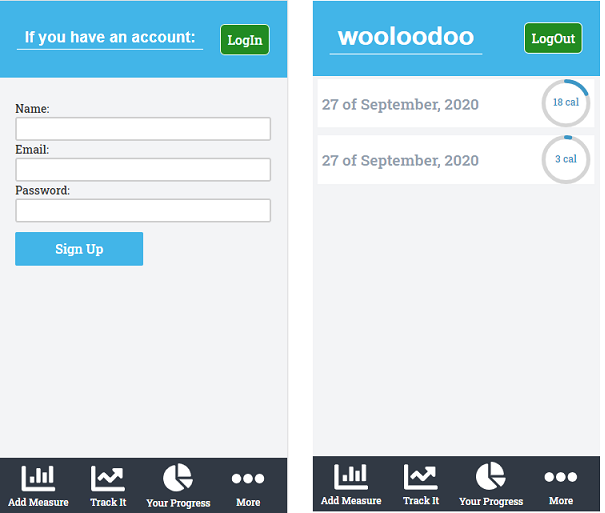

<!--
*** Thanks for checking out this README Template. If you have a suggestion that would
*** make this better, please fork the repo and create a pull request or simply open
*** an issue with the tag "enhancement".
*** Thanks again! Now go create something AMAZING! :D
-->

<!-- PROJECT SHIELDS -->
<!--
*** I'm using markdown "reference style" links for readability.
*** Reference links are enclosed in brackets [ ] instead of parentheses ( ).
*** See the bottom of this document for the declaration of the reference variables
*** for contributors-url, forks-url, etc. This is an optional, concise syntax you may use.
*** https://www.markdownguide.org/basic-syntax/#reference-style-links
-->
[![Contributors][contributors-shield]][contributors-url]
[![Forks][forks-shield]][forks-url]
[![Stargazers][stars-shield]][stars-url]
[![Issues][issues-shield]][issues-url]


<!-- PROJECT LOGO -->
<br />
<p align="center">
  <a href="https://github.com/vzdrizhni//Food-tracker-front">
    
  </a>

  <h3 align="center">ReactJs --> [Food-tracker-front App]</h3>

  <p align="center">
    This is a Food-tracker-front app built with React.
    <br />
    <a href="https://github.com/vzdrizhni//Food-tracker-front"><strong>Explore the docs »</strong></a>
    <br />
    <br />
    <a href="https://github.com/vzdrizhni//Food-tracker-front/issues">Report Bug</a>
    ·
    <a href="https://github.com/vzdrizhni//Food-tracker-front/issues">Request Feature</a>
  </p>
</p>

<!-- TABLE OF CONTENTS -->
## Table of Contents

* [About the Project](#about-the-project)
  * [Built With](#built-with)
  * [Usage](#usage)
  * [Automated Test](#automated-test)
* [Contributors](#contributors)
* [Acknowledgements](#acknowledgements)
* [License](#license)

<!-- ABOUT THE PROJECT -->
## About The Project
  The Food-tracker-front is a capstone project based on a tracking application.



### Built With
This project was built using these technologies.
* HTML/CSS
* ReactJs
* JavaScript
* Heroku Buildpack
* ESLint
* StyleLint
* GithubActions :muscle:

<!-- INSTALLATION -->
## Usage

To have this app on your pc, you need to:
* [download](https://github.com/vzdrizhni//Food-tracker-front/archive/develop.zip) or clone this repo:
  - Clone with SSH:
  ```
    git@github.com:vzdrizhni//Food-tracker-front.git
  ```
  - Clone with HTTPS
  ```
    https://github.com/vzdrizhni//Food-tracker-front.git
  ```

* In the project directory, you can run:

  - `$ yarn install` - installs all the dependencies required by the project

  - `$ yarn start` - runs the app in the development mode:
    - Open [http://localhost:3000](http://localhost:3000) to view it in the browser.
    - The page will reload if you make edits.
    - You will also see any lint errors in the console.

  - `$ yarn test`
    - Launches the test runner in the interactive watch mode.
    - See the section about [running tests](https://facebook.github.io/create-react-app/docs/running-tests) for more information.

  - `$ yarn build`
    - Builds the app for production to the `build` folder.
    - It correctly bundles React in production mode and optimizes the build for the best performance.
    - The build is minified and the filenames include the hashes.
    - Your app is ready to be deployed!

## Automated Test
 - `$ yarn test`
    - Launches the test runner in the interactive watch mode.<br />
    - See the section about [running tests](https://facebook.github.io/create-react-app/docs/running-tests) for more information.

## Live Demo & Deployment
The project has been deployed with Github Pages.

[GitHub Pages Live Demo Link](https://vzdrizhni.github.io/Food-tracker-front/) :point_left:

<!-- CONTACT -->
## Contributors

👤 **Roman Nikolaev**

- LinkedIn: [Roman Nikolaev]https://www.linkedin.com/in/romannikolaev/)
- GitHub: [vzdrizhni](https://github.com/vzdrizhni)
- E-mail: vzdrizhni@gmail.com

## :handshake: Contributing

Contributions, issues and feature requests are welcome!

Feel free to check the [issues page](https://github.com/vzdrizhni//Food-tracker-front/issues).

## Show your support

Give a :star: if you like this project!

<!-- ACKNOWLEDGEMENTS -->
## Acknowledgements
* Design idea by [Gregoire Vella on Behance](https://www.behance.net/gregoirevella)
* [Microverse](https://www.microverse.org/)
* [The Odin Project](https://www.theodinproject.com/)
* [React Documentation](https://reactjs.org/docs/getting-started.html)
* [Heroku Documentation](https://devcenter.heroku.com/)
* [Heroku Buildpack](https://github.com/mars/create-react-app-buildpack#user-content-requires)

<!-- MARKDOWN LINKS & IMAGES -->
<!-- https://www.markdownguide.org/basic-syntax/#reference-style-links -->
[contributors-shield]: https://img.shields.io/github/contributors/vzdrizhni/Food-tracker-front.svg?style=flat-square
[contributors-url]: https://github.com/vzdrizhni/Food-tracker-front/graphs/contributors
[forks-shield]: https://img.shields.io/github/forks/vzdrizhni/Food-tracker-front.svg?style=flat-square
[forks-url]: https://github.com/vzdrizhni/Food-tracker-front/network/members
[stars-shield]: https://img.shields.io/github/stars/vzdrizhni/Food-tracker-front.svg?style=flat-square
[stars-url]: https://github.com/vzdrizhni/Food-tracker-front/stargazers
[issues-shield]: https://img.shields.io/github/issues/vzdrizhni/Food-tracker-front.svg?style=flat-square
[issues-url]: https://github.com/vzdrizhni/Food-tracker-front/issues

## 📝 License

This project is [MIT](https://opensource.org/licenses/MIT) licensed.
